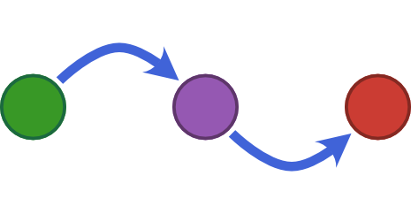

# ChiralWaveguide.jl

<!--  -->

*ChiralWaveguide.jl* is a package for the simulation of arbitrary quantum systems that are coupled
to one-dimensional bosons with chiral propagation &mdash; in other words, a waveguide-like system.
The package is build around [QuantumOptics.jl], the syntax is inspired by the [SciML]
ecosystem and the theory is from [A. Kiilerich, K. Mølmer].

The setup of a chiral waveguide consists of up to three constituents:
1. The quantum system,
2. [optional] bosons / photons in one specific mode, driving the system and
3. [optional] a specific mode "behind" the quantum system, which is observed.
In this sense, *ChiralWaveguide.jl* solve an one-dimensional scattering problem, while keeping track
of the internal dynamics of the quantum system.

Performance was the top priority in the design *ChiralWaveguide.jl*.
The automatic system creation only builds the components necessary for each particular simulation
and heavily uses transformation of the Hilbert space to reduce its memory footprint.
Right now, this approach sacrifices a little flexibility for this.
Yet I fully intend to include all missing features in the future.

## Roadmap

Right now this package can be considered ready-for-use and tested, but there is also room for growth.
Possible additions include:

1. Enable the simulation of multiple input and output modes.
2. Provide more flexibility (e.g. allow time-dependant systems)
3. Implement even more features and use even more tricks to increase performance.

Please feel free to contact me if you intend to use the package at the current state and want to
know more.

[QuantumOptics.jl]: https://qojulia.org/
[SciML]: https://sciml.ai/
[A. Kiilerich, K. Mølmer]: https://journals.aps.org/prl/abstract/10.1103/PhysRevLett.123.123604
