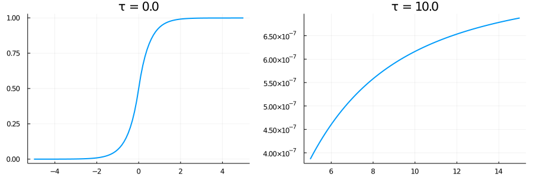
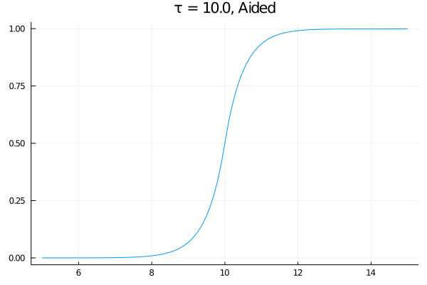

# Creating custom modes

The constructor of [`Mode`](@ref) automatically determines the coupling rates
```math
\begin{aligned}
	gᵢ &=  \frac{u(t)}{\sqrt{1 - \int_{-\infty}^t |u(s)|^2 ds}}, \\
	gₒ &= -\frac{u(t)}{\sqrt{    \int_{-\infty}^t |u(s)|^2 ds}}
\end{aligned}
```
from the provided wave function ``u``, by numerically integration the integral in the denominator,
stored in `Mode.norm`.
This process is designed to be as robust as possible, however, for special choices of ``u`` the
integrator may struggle.
This is *for example* the case when ``u`` sharply peaked or peaked far away from the origin.
In these situations we have two options:
1. Give the integrator hints about the wave function.
2. Provide the analytic coupling rates.
We will now explore both options for the wave function ``u(t) = \sqrt{γ}\exp(-γ|t-τ|)``.

## Aiding the integrator
*ChiralWaveguide* provides the tools to easily combat the most typical problems.
If we set ``τ ≫ 1`` in the upper example the integrator fails to find suitable integration points
```
u(t, τ, γ) = √(γ) * exp(-γ * abs(t - τ))

τ = 0.0
pA = plot(τ .+ [-5:0.1:5;], Mode(t -> u(t, τ, 0)).norm, title = "τ = $(τ)", label = nothing)

τ = 10.0
pB = plot(τ .+ [-5:0.1:5;], Mode(t -> u(t, τ, 0)).norm, title = "τ = $(τ)", label = nothing)

plot(pA, pB, size = (900, 300))
```

To find `Mode.norm` the integrator first maps ``ℝ → (-1, 1)``.
The map can be specified by passing a [`ChiralWaveguide.Compression`](@ref) to the `compression`
keyword argument.
Here, we can also specify the approximate center and width of the wave function.
The default choice is [`Algebraic`](@ref), so lets try this here
```
plot(τ .+ [-5:0.1:5;], Mode(t -> u(t, τ, 0), compression = Algebraic(μ = τ)).norm,
	title = "τ = $(τ), Aided", label = nothing
)
```


Additionally, a sharply peaked wave function may decrease the accuracy of the determined norm and,
in turn, of `gᵢ` and `gₒ`.
Consider
```
τ = 0.0
γ = 50
Mode(t -> u(t, τ, γ)).norm(1e5)
# == 1.016513761511986
```
Even though ``u`` is normalised, the integrator over estimates the result.
While the construction of `gᵢ` and `gₒ` are build with non-normalised wave functions in mind and
are resilient against deviations (they won't diverge) this may still lead to small inaccuracies.
In problems where accuracy is key, we want to tell the integrator the approximate width of the
wave function
```
Mode(t -> u(t, τ, γ), compression = Algebraic(μ = τ, σ = 1/γ)).norm(1e5)
# == 0.9990907077615423
```
This already yields 3 significant digits and likely is good enough for all applications.
However, we can still improve upon this by increasing the accuracy of the integrator
```
Mode(t -> wf(t, τ, γ), compression = Algebraic(μ = τ, σ = 1/γ), reltol = 1e-6).norm(1e5)
# == 0.999999763224909
```
Lastly, it should be noted that potential problems are manyfold and before using any of the
described techniques one should always screen for the precise origin of the problem first.
Especially mode functions which rely on special functions like the error function can be problematic
since their implementation might not be stable at large `t` and one should probably introduce a
manual cutoff.

## Providing exact coupling rates
Provided we have an analytic formula for ``\int_{-\infty}^t |u(s)|^2 ds`` we may also provide the
rates `gᵢ` and `gₒ` directly.
in our example we have
```math
\int_{-\infty}^t |u(s)|^2 ds =
\begin{cases}
	    \frac{1}{2}\exp(-2γ|t-τ|) & t < τ \\
	1 - \frac{1}{2}\exp(-2γ|t-τ|) & t ≥ τ
\end{cases}
```
The creation of the exact mode function is now accomplished with
```
function norm(t, τ, γ)
	t < τ && return 0.5 * exp(-2γ * (τ - t))
	return 1 - 0.5 * exp(-2γ * (t - τ))
end

gᵢ(t, τ, γ) =  u(t, τ, γ) / √(1 - norm(t, τ, γ))
gₒ(t, τ, γ) = -u(t, τ, γ) / √(    norm(t, τ, γ))

τ, γ = 0.0, 1.0
mode = Mode(t -> u(t, τ, γ), t -> gᵢ(t, τ, γ), t -> gₒ(t, τ, γ), t -> norm(t, τ, γ))
```
Note that if you only ever want to use your mode as a input (output) mode, it suffices to simply
provide `u` and/or `gᵢ` (`gₒ`).
`norm` is only used when the mode function is constructor automatically and can be ignored most of
the time.
The drawbacks of course are that you loose flexibility and possibly a way to do consistency checks,
so use this power with care.
