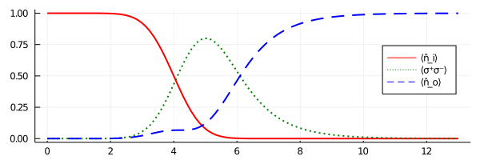

# Scattering of a single photon

In this example, we analyse the scattering of a single photon in a Gaussian mode at a single chiral
two level atom.
For comparison, we reconstruct the second figure from the paper from [A. Kiilerich, K. Mølmer](https://journals.aps.org/prl/abstract/10.1103/PhysRevLett.123.123604), on which this package is based.
For this problem, the scatter problem can be solved analytically and the the outgoing mode function
is
```math
	\psi_\mathrm{out}(t) \propto \exp\left(-\frac{(t - τ)^2}{2}\right)
		- \sqrt{\frac{π}{2}} \exp\left(- \frac{t - τ}{2} + \frac{1}{8} \right)
		  \mathrm{erfc}\left(\frac{-2(t - τ) + 1}{2 \sqrt{2}}\right),
```
where the incoming Gauss mode has a width of ``\sigma = 1`` and it's center of mass arrives at the
atom at time ``\tau``.

We start the simulation by loading the necessary packages
```
using ChiralWaveguide, Plots, SpecialFunctions # SpecialFunctions has erfc
```
defining the incoming single photon wave packet
```
wavepacket = WavePacket(GaussMode(τ = 4.0), Fock(1))
```
and create the final mode we want to observe (notice the mode does not have to be normalised)
```
function outputModeFunction(t, τ = 4.0)
	abs(t-τ) > 10 && return 0.0 # cutoff for numerical stability
	return exp(-(t - τ)^2/2) -
		√(π/2) * exp(-(t - τ) / 2 + 1 / 8) * erfc((-2(t - τ) + 1) / (2 * √(2)))
end

outputMode = Mode(t -> outputModeFunctionFig2(t, 1.0, 4.0))
```
Notice that we did not provide the coupling rates for the `outputMode` ourself but let the
constructor of `Mode` take care of that, which numerically solves the integrals for us.

We now have every constituents to define
```
problem = WaveguideProblem(TwoLevelChain(1), wavepacket, outputMode, 13.0)
```
and solve the scattering problem
```
ts, ρs = solve(problem)
```

This already completes the simulation and we can now define the observables of interest.
The density matrices `ρs` at time `ts` are ordinary [QuantumOptics.jl](https://qojulia.org/)
operators and we can therefore utilise every tool within *QuantumOptics.jl*.
```
basis  = ρs[end].basis_l
n̂ᵢ, n̂ₒ = number(basis.bases[1]), number(basis.bases[3])
σ⁺σ⁻   = transition(NLevelBasis(2), 2, 2)
```
Finally, we draw the populations of the input cavity, the excited state of the atom, and the
output cavity, resulting in the same figure as from the paper:
```
plot( ts, expect(1, n̂ᵢ,   ρs) .|> real, label = "⟨n̂_i⟩",  line = (2, :red))
plot!(ts, expect(2, σ⁺σ⁻, ρs) .|> real, label = "⟨σ⁺σ⁻⟩", line = (2, :green, :dot))
plot!(ts, expect(3, n̂ₒ,   ρs) .|> real, label = "⟨n̂_o⟩",  line = (2, :blue,  :dash))
plot!(size = (600, 200), legend = :right)
```


---
_Entire Script_
```
using ChiralWaveguide, Plots, SpecialFunctions # SpecialFunctions has erfc

wavepacket = WavePacket(GaussMode(τ = 4.0), Fock(1))

function outputModeFunction(t, τ)
	abs(t-τ) > 10 && return 0.0 # cutoff for numerical stability
	return exp(-(t - τ)^2/2) -
		√(π/2) * exp(-(t - τ) / 2 + 1 / 8) * erfc((-2(t - τ) + 1) / (2 * √(2)))
end

outputMode = Mode(t -> outputModeFunction(t, 4.0))

problem = WaveguideProblem(TwoLevelChain(1), wavepacket, outputMode, 13.0)
ts, ρs = solve(problem)

basis  = ρs[end].basis_l
n̂ᵢ, n̂ₒ = number(basis.bases[1]), number(basis.bases[3])
σ⁺σ⁻   = transition(NLevelBasis(2), 2, 2)

plot( ts, expect(1, n̂ᵢ,   ρs) .|> real, label = "⟨n̂_i⟩",  line = (2, :red))
plot!(ts, expect(2, σ⁺σ⁻, ρs) .|> real, label = "⟨σ⁺σ⁻⟩", line = (2, :green, :dot))
plot!(ts, expect(3, n̂ₒ,   ρs) .|> real, label = "⟨n̂_o⟩",  line = (2, :blue,  :dash))
plot!(size = (600, 200), legend = :right)
```
